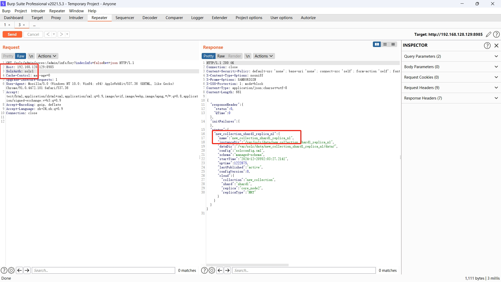

# apache-solr-auth-bypass
## 环境搭建
用dcoker搭建，配置文件在f1.zip中，服务运行后访问[http://127.0.0.1:8983/](http://127.0.0.1:8983/)（账号密码solr/SolrRocks），new collection

## CVE-2024-45216漏洞利用
正常访问401

加上SolrAuth头和url后缀:/admin/info/key绕过

认证绕过部分结束
___
## 下面是文件读取部分
开启Remote Streaming，这次不知道为什么报错了，但是不影响结果

读取文件

