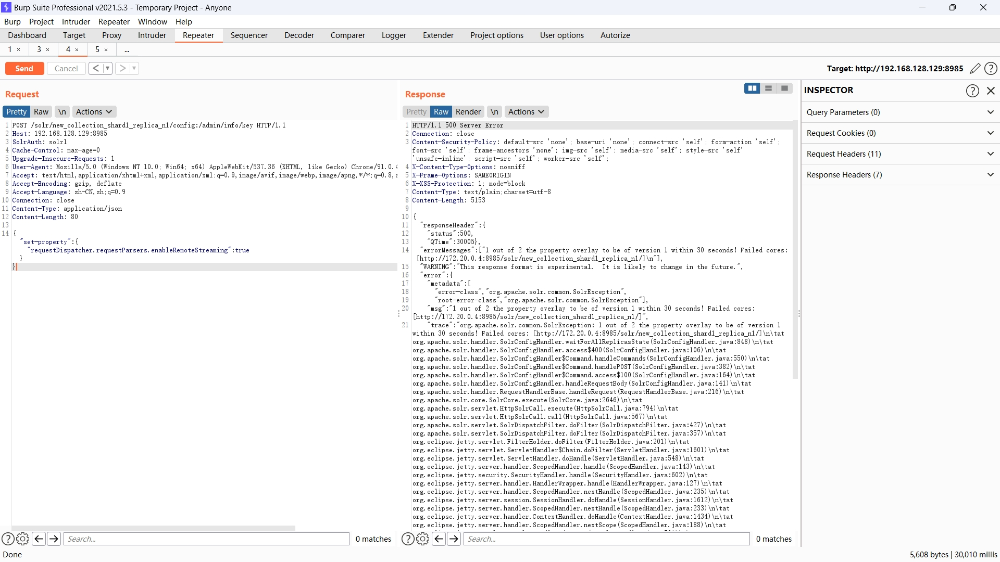

# apache-solr-auth-bypass
## 环境搭建
经验不足踩坑太多，具体不写了，总结就是docker用zookeeper1.4.14和solr8.8，solr多开一个端口用来搭建集群。
进容器
```javascript
solr zk cp ./security.json zk:security.json -z zookeeper:2181 // security.json用官方给的模板
solr start -c -m 1g -z zookeeper:2181 -p 8985 // 手动开cloud
```

## CVE-2024-45216漏洞利用
正常访问401

加上SolrAuth头和url后缀:/admin/info/key绕过

认证绕过部分结束
___
## 下面是文件读取部分
开启Remote Streaming，这次不知道为什么报错了，但是不影响结果

读取文件

