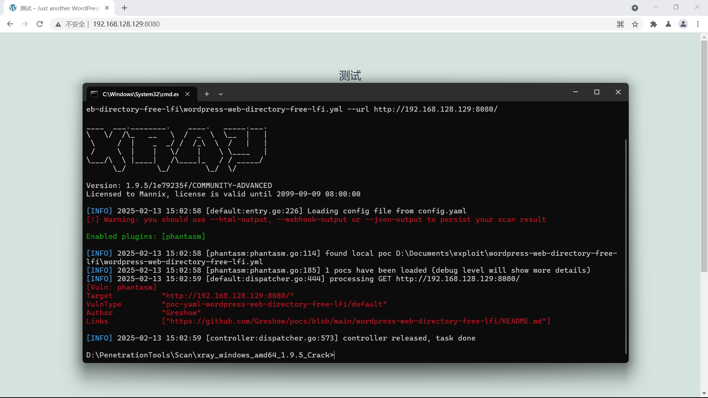

# wordpress-web-directory-free-lfi
CVE-2024-3673漏洞利用
include在w2dc_renderTemplate函数被利用

w2dc_renderTemplate函数通过w2dc_frontend_controller类的display方法调用

template参数是初始化时传入的

值是$_POST['template']

最后构造请求wp_ajax_w2dc_controller_request

